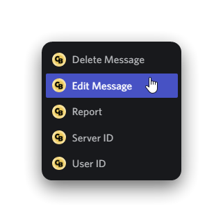

# Getting Started

## Before We Begin...

We ask that you double-check if you have given ChatBot the right permissions. If you do not wish to give it all the permissions, make sure it has `Manage Messages`, `Embed Links` and `Send Messages` permission.


The Discord bot we offer is not an AI bot, but a bot that allows you to communicate with other real Discord servers!


## Features!

If you are still unsure if ChatBot is the right bot for you, here are some pictures showcasing its features! :smile:

<figure><figcaption>
Talking to other servers who use the bot from the safety of your own server!
</figcaption></figure>

<figure><figcaption>
Network Actions
</figcaption></figure>

...and more
