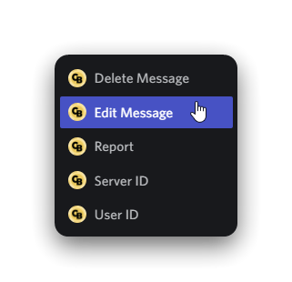

# Replying to a message

So you want to reply to a message that was sent in the network, but don't know how... We've got you covered! Chatbot allows you to reply to messages that were sent in the past 12 hours in a simple and native manner. Click the reply button on a message sent by Chatbot, and it should take care of the rest. 👍

.png>)  

